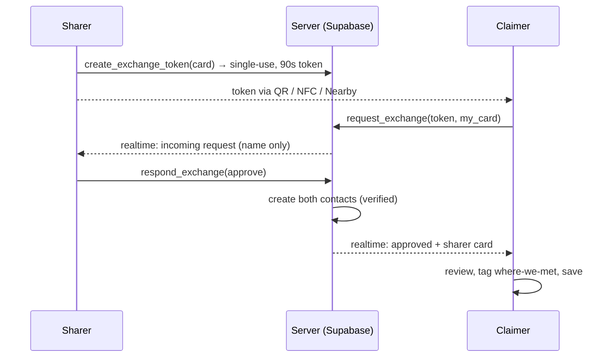

# Architecture

This document explains how Xchange is structured and why. For setup and contribution
workflow, see [CONTRIBUTING.md](CONTRIBUTING.md).

## Overview

Xchange is an [Expo](https://expo.dev) (SDK 56) React Native app for exchanging contact
cards. QR is the primary exchange method, with Tap (NFC) and an AirDrop-style Nearby radar
as alternates. The app is written in TypeScript and uses file-based routing via
expo-router.

A defining design choice is that the app runs in **two modes**, resolved once at startup
from whether a backend is configured:

| Mode | When | Behaviour |
| --- | --- | --- |
| **Local** | no Supabase env vars | Seeded sample data, no sign-in, fully simulated exchange. Great for a zero-config demo. |
| **Cloud** | Supabase configured | Real email auth, synced data, and a secure server-mediated exchange. |

Screens are written once and are mode-agnostic — the difference lives entirely behind the
data layer (see [Data layer](#data-layer)).

## Tech stack

- **Expo SDK 56 / React Native 0.85 / React 19** — `expo-router` (routes in `src/app`).
- **Supabase** — Postgres, Auth, Realtime, and Row-Level Security.
- **TanStack Query** — server state (fetching, caching, mutations, realtime invalidation).
- **Zustand** — local/device state (session, active card, settings, local-mode seed data).
- **NativeWind v4 + Tailwind** — design tokens; most components use inline styles for
  pixel-exact spacing.
- **expo-camera** (QR scan), **react-native-qrcode-svg** (QR render), **expo-crypto**
  (payload signing), **expo-linear-gradient**, **expo-haptics**, **@expo-google-fonts**.

## Directory layout

```
src/
  app/                       expo-router routes
    _layout.tsx              providers + font loading + auth/onboarding route guard
    (auth)/sign-in.tsx       email + password / one-time code
    (tabs)/                  Card (index), People, Activity, Profile + custom tab bar
    exchange.tsx             QR / Tap / Nearby overlay + exchange orchestration
    onboarding.tsx  edit.tsx  tweaks.tsx  contact/[id].tsx
  data/                      server state — unified hooks (Supabase OR local)
    query.tsx                QueryClient provider
    cards.ts  contacts.ts    card & contact hooks (+ realtime)
    exchange.ts  nearby.ts    secure exchange client + Nearby presence lobby
  lib/                       Supabase client, colour utilities, formatting
  state/                     zustand: auth session, active-card UI, settings, local stores
  services/payload.ts        client-side integrity signing
  components/                design-system + feature components
  theme/                     design tokens + accent hook
supabase/migrations/         database schema, RLS policies, and exchange functions
```

## Navigation & route guard

Routing is file-based (expo-router). [`src/app/_layout.tsx`](src/app/_layout.tsx) loads
fonts, waits for stores to hydrate, and runs a guard that redirects:

- no session (cloud mode) → `(auth)/sign-in`
- session but no card yet → `onboarding`
- otherwise → the tab app

The tab bar is custom (`components/TabBar.tsx`) to support the centre "Exchange" FAB.

## Data layer

The core abstraction: **screens never talk to Supabase or the local stores directly** —
they call hooks in `src/data/*`, which transparently choose the source based on
`isConfigured` (from `lib/supabase.ts`):

```ts
// src/data/cards.ts (simplified)
export function useCards() {
  const local = useProfile((s) => s.profiles);        // local-mode seed store
  const userId = useUserId();
  const q = useQuery({ queryKey: ['cards', userId], enabled: isConfigured && !!userId, queryFn: fetchCards });
  if (!isConfigured) return { byKind: local, loading: false };
  return { byKind: mergeByKind(q.data ?? []), loading: q.isLoading };
}
```

The same pattern backs `useContactList`, `useAddContact`, `useToggleFav`, etc. In cloud
mode a realtime subscription (`useContactsRealtime`) invalidates the contact query so
exchanges initiated on another device appear instantly.

Device-level state (which card is active, accent/layout/privacy preferences) lives in
zustand stores (`state/ui.ts`, `state/settings.ts`) and is read directly.

## Backend

The schema lives in [`supabase/migrations/0001_init.sql`](supabase/migrations/0001_init.sql)
and is applied via the Supabase SQL editor. Four tables, all under **Row-Level Security**
so a user can only ever read their own rows:

- `cards` — a user's shareable cards (one per kind: personal / work).
- `contacts` — people you've exchanged with.
- `exchange_tokens` — short-lived, single-use pairing tokens.
- `pending_exchanges` — a request awaiting the sharer's approval.

Writes that cross users go through `SECURITY DEFINER` functions rather than table policies,
so the rules are centralised and auditable: `create_exchange_token`, `request_exchange`,
`respond_exchange`. Realtime is enabled on `pending_exchanges` and `contacts`; Nearby
discovery uses a Realtime **presence** channel.

## Secure exchange

The exchange is **server-mediated** so identity is verifiable rather than assumed. A card
is never readable without a fresh token *and* the owner's explicit approval.



Properties:

- **No silent harvesting** — RLS + a required token + owner approval.
- **Replay-proof** — tokens are single-use and expire in 90 seconds.
- **Server-verified identity** — a token maps to a real authenticated user, so saved
  contacts are marked *verified*.
- **Off-by-default discovery** — Nearby presence is a privacy toggle and only active while
  the Exchange screen is open.

In local mode there is no server: QR/Tap/Nearby resolve to a demo contact, and payloads are
SHA-256 signed/verified client-side (`services/payload.ts`) as a tamper check.

Tap (NFC) and true cross-device Nearby (BLE) require native modules and a development build;
they share the same token primitive, so only the *carrier* changes when they're added —
the request/approve/confirm logic is unchanged.

## Design system

Tokens are in [`src/theme/index.ts`](src/theme/index.ts): a near-black canvas, graphite
surfaces, and a swappable brand accent (5 options) whose soft/line/ink variants are derived
at runtime. Each person has a `hue`; avatars and the gradient card are built from a
two-stop **OKLCH** gradient converted to sRGB in [`src/lib/color.ts`](src/lib/color.ts)
(React Native can't parse `oklch()`). Typography is Space Grotesk (display) / Manrope
(body) / Space Mono (labels).

## Key decisions

- **Unified data hooks over a mode flag.** Keeping the local/cloud split behind
  `src/data/*` means the entire UI is written once and the app is demoable with zero setup,
  yet production-ready with a backend.
- **Server-mediated exchange over peer-to-peer crypto.** With auth in place, a token +
  approval flow gives real identity verification and a clean audit trail, and works today
  over QR without native modules.
- **`SECURITY DEFINER` functions for cross-user writes.** Table RLS stays strict
  (owner-only); all sharing logic is centralised in reviewed database functions.
- **Inline styles for design-exact layout.** NativeWind is available for structure, but the
  design called for precise spacing that's clearest expressed inline.
